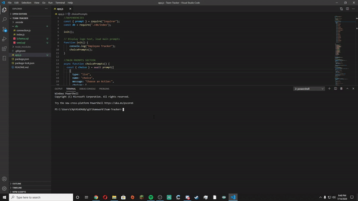

  # Employee-Tracker

  
  
  ---

  ## Description
    - Command line app to track a companies employee's role, pay, and manager

---
  ## Table of Contents
   - [Installation](#installation)
   - [Usage](#usage)
   - [Contributors](#contributors)
   - [Tests](#tests)
   - [Demo](#demo)
   - [Questions](#questions)
   - [License](#license)

 ---

  ## Installation
 
  - To install necessary dependencies, run the following command:

```
  npm start
```

---

  ## Usage
 The purpose of this CLI is to be able to view and manage departments, roles, and employees to help organize within the company.

  ### User Story

```
  AS a HR manager

  I WANT a Team Tracker

  SO THAT I can Track my employees by role, manager, and salary easily.
```

---

  ## Contributors

  - Lance Page

 ---
 
  ## Tests

  To run tests, run the following command:

```
  npm run test
  ```
  ---
  
  ## Demo
  
  ## 
  
  ---
  
  ## Questions
  
  if you have questions please leave a comment.
  
  ---
  
   ## License

  This project is licensed under the ISC license.

